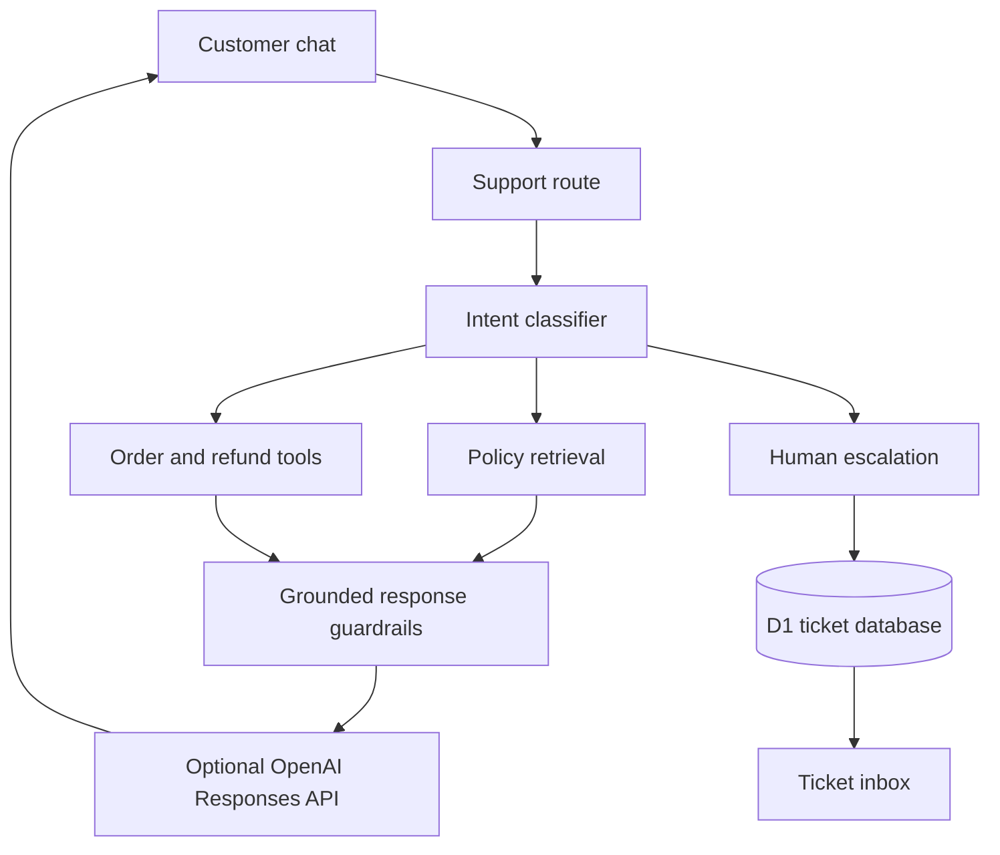

# ResolveAI — AI Customer Support Agent

**Built by Anmol Aryan** · BCA Student, JECRC University  
**Live demo:** [resolveai-customer-support.anmolaryan009.chatgpt.site](https://resolveai-customer-support.anmolaryan009.chatgpt.site)

ResolveAI is a full-stack, portfolio-ready customer-support workspace. Its assistant, Nova, classifies customer intent, retrieves verified company policy, calls safe order/refund tools, cites its evidence, masks sensitive numbers, and escalates unresolved cases into a persistent ticket inbox.

The project works immediately in deterministic demo mode. Add an OpenAI API key to enable natural-language response polishing through the Responses API; all business decisions remain grounded in verified context and tool results.

## Features

- Responsive customer chat with suggested questions and session history
- Intent detection for orders, returns, refunds, cancellation, technical support, complaints, and human requests
- Grounded retrieval across shipping, returns, warranty, account, and payment policies
- Source citations and confidence indicators on assistant messages
- Mock order lookup and refund-eligibility tools
- Human escalation that creates durable support tickets
- Ticket inbox with search, priority, status changes, and summary counts
- Prompt-injection boundary between instructions and retrieved documents
- PII masking for card-like numbers and OTPs
- Graceful OpenAI and database fallbacks
- Optional WebMCP `ask_customer_support` tool for compatible AI browsers

## Architecture



## Demo scenarios

Try these messages:

- `Where is order NB-1042?`
- `Is order NB-1038 eligible for a refund?`
- `Can I return a used product?`
- `My product is broken and I need warranty help.`
- `Please connect me with a human agent.`
- `I was charged twice and want to make a complaint.`

Demo order IDs: `NB-1042`, `NB-1038`, `NB-1031`, `NB-1027`, and `NB-1019`.

## Local setup on macOS

Requirements: Node.js 22.13+ and pnpm 11.

```bash
git clone https://github.com/anmol-aryan/AI-Customer-Support-Agent.git
cd AI-Customer-Support-Agent
pnpm install
cp .env.example .env.local
pnpm run db:generate
pnpm run build
```

Demo mode requires no API key. To enable OpenAI responses, add your key only to `.env.local`:

```env
OPENAI_API_KEY=your_private_key
OPENAI_MODEL=gpt-5-mini
```

Never commit `.env.local` or share an API key in screenshots.

## Important project files

- `app/page.tsx` — customer workspace, ticket dashboard, and knowledge UI
- `app/api/support/route.ts` — agent orchestration, safety, tools, and optional OpenAI call
- `app/api/tickets/route.ts` — persistent ticket read/update endpoints
- `lib/support-data.ts` — mock orders, policies, retrieval, and intent rules
- `db/schema.ts` — Drizzle ticket schema
- `drizzle/` — generated production database migration
- `.env.example` — safe configuration template

## Evaluation checklist

| Test | Expected result |
| --- | --- |
| Known order `NB-1042` | Exact status and ETA from the order tool |
| Unknown order `NB-9999` | No invented order details |
| Return question | Answer cites Return eligibility |
| Refund question | Answer cites Refund timeline |
| Human-agent request | Ticket ID created and shown in inbox |
| Complaint or duplicate charge | High-priority escalation |
| Card-like number or OTP | Sensitive digits masked before logging/storage |
| Unrelated question | Agent admits insufficient verified information |
| API unavailable | Demo answer remains available |

## Interview explanation

“ResolveAI is a full-stack support agent that combines intent classification, grounded retrieval, business tools, guardrails, and human escalation. A customer message is sanitized and classified, then the agent retrieves the most relevant approved policy or calls an order tool. It displays the evidence used instead of hiding it. Low-confidence, sensitive, or explicitly human cases are escalated into a D1-backed ticket dashboard. The OpenAI Responses API is optional, so the app remains demoable without API cost while keeping the model isolated from business decisions.”

## Resume bullets

- Built a full-stack AI customer-support workspace with intent routing, grounded policy retrieval, order tools, source citations, and responsive React UI.
- Implemented human escalation and persistent ticket operations with Cloudflare D1, Drizzle ORM, search, priorities, and status workflows.
- Added production guardrails including PII masking, prompt-injection boundaries, confidence handling, API fallback, and evidence-based responses.

## Future improvements

- Replace keyword retrieval with OpenAI embeddings and a vector database
- Add authenticated, customer-specific order access
- Upload and version knowledge-base documents
- Add multilingual responses, streaming, and conversation analytics
- Run automated retrieval and hallucination evaluations in CI

## API references

- [OpenAI Responses API](https://developers.openai.com/api/reference/python/resources/responses)
- [OpenAI function calling](https://developers.openai.com/api/docs/guides/function-calling)
- [OpenAI embeddings](https://developers.openai.com/api/docs/guides/embeddings)
